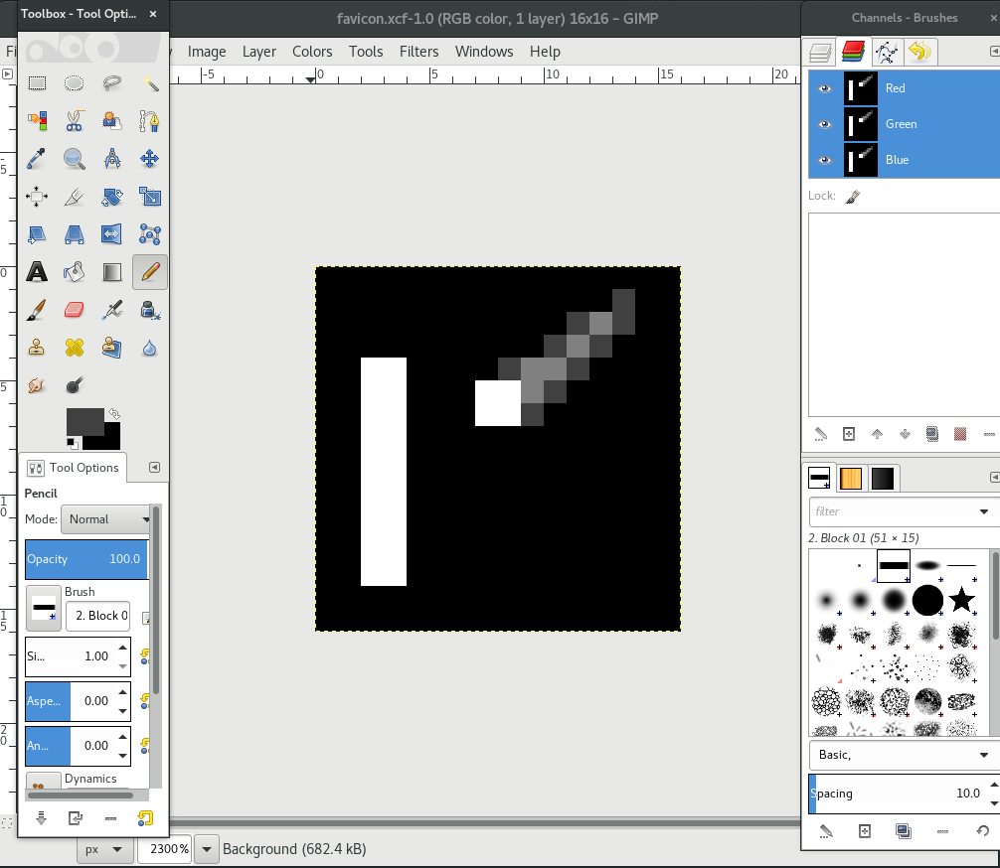
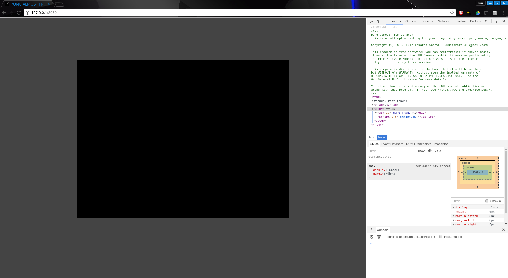

# PONG ALMOST FROM SCRATCH
This is an attempt of making the game pong using modern programming languages

## Tech
The game is based in html5/canvas, CSS and ES6 javascript.

## Goals
* ~~Add `LICENSE.md` and `README.md`~~
* ~~Create `html/canvas` base~~
* Create the gameloop
* Crate rendering functions
* Design board
* Create scoring system
* Create paddle `class`
* Create ball `class`
* Implement collision mechanics
* ~~Host somewhere~~
* Create start screen
* Create enemy AI

All that while reporting

## Progress reports
* ### Create `html/canvas` base

The `html` file was created based on a simple template.
```html
  <html>
    <head>
      <title>PONG ALMOST FROM SCRATCH</title>
      <meta name="description" content="This is an attempt of making the game pong using modern programming languages">
      <link id="favicon" rel="icon" href="assets/favicon.ico" type="image/x-icon">
      <meta charset="utf-8">
      <link rel="stylesheet" href="style.css">
    </head>
    <body>
      <div id="game-frame">
      </div>
      <script src="script.js"></script>
    </body>
  </html>
```

The `favicon.ico` was created using GIMP:


The canvas is created in the `javascript`.

We'll be using an ancient post from [Arthur Schreiber
](http://nokarma.org/2011/02/02/javascript-game-development-the-game-loop/index.html) as our base for the gameloop and keyboard input.
```javascript
"use strict"
let Game = {
  fps: 60,
  width: 800,
  height: 600
};
Game.canvas = document.createElement("canvas"); // Create canvas
Game.canvas.setAttribute("id", "game");
Game.canvas.width = Game.width;
Game.canvas.height = Game.height;

document.getElementById("game-frame").appendChild(Game.canvas); // Add canvas to game-frame

Game.context = Game.canvas.getContext("2d"); // Get canvas context
```
And a little bit of styling just to make it a little neat

```css
html {
  background-color: #444;
}
#game-frame {
  position: relative;
}

#game {
  background-color: #000;
  position: absolute;
  top: 50%;
  left: 50%;
  margin: 150px 0 0 -400px;
}
```
So, here is the first view of the game:
#### Hello world!


* ### Host somewhere

For now, I'll be hosting it in [github pages](https://pages.github.com/) since it's easy deploy. Check it out [here](https://armlessjohn404.github.io/pong-almost-from-scratch/)
