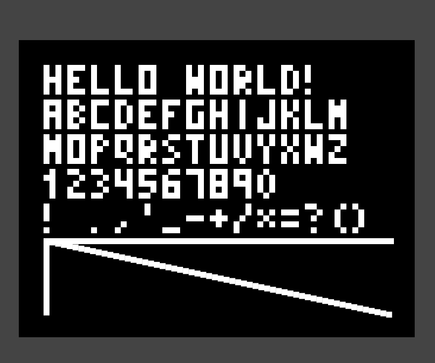
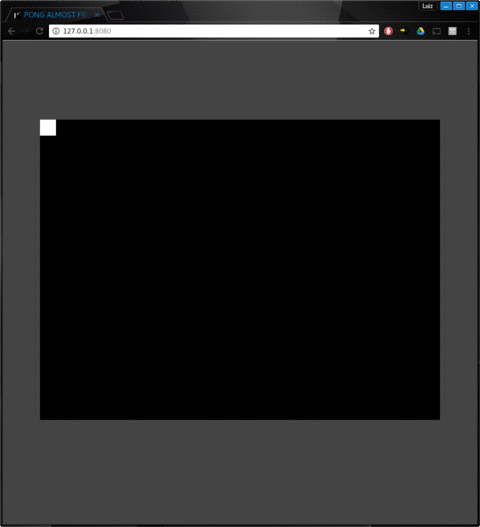
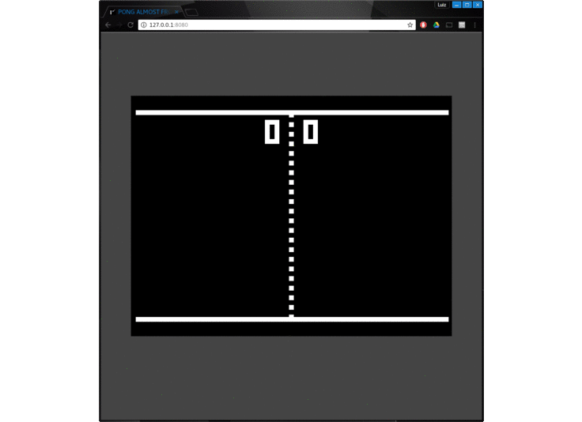
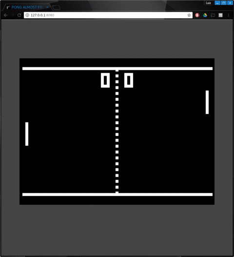
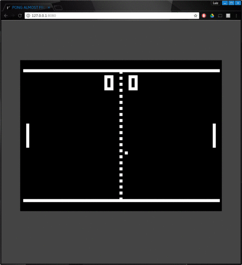
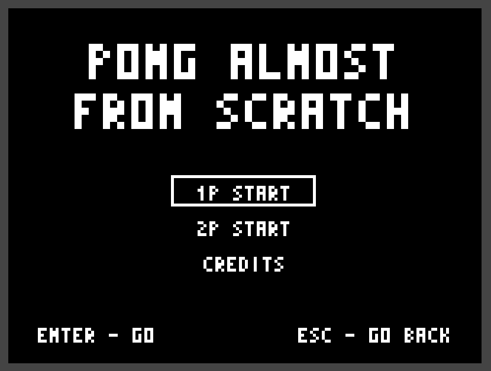
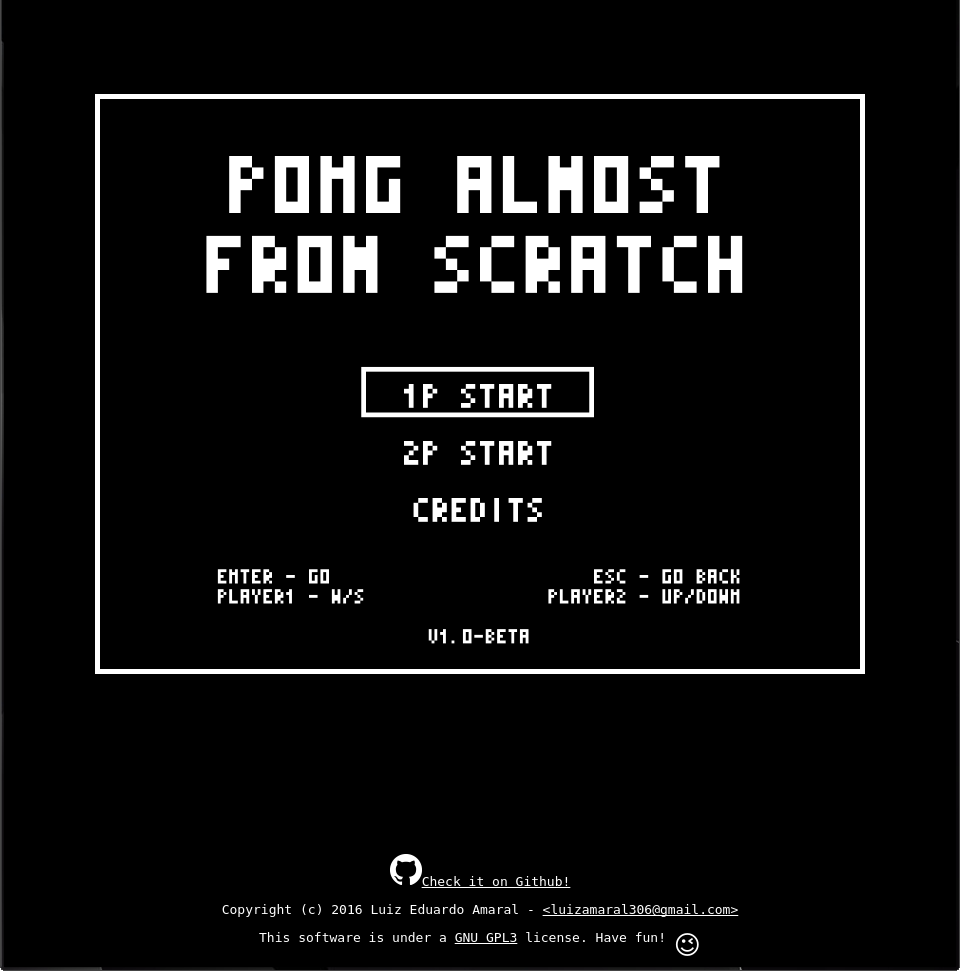
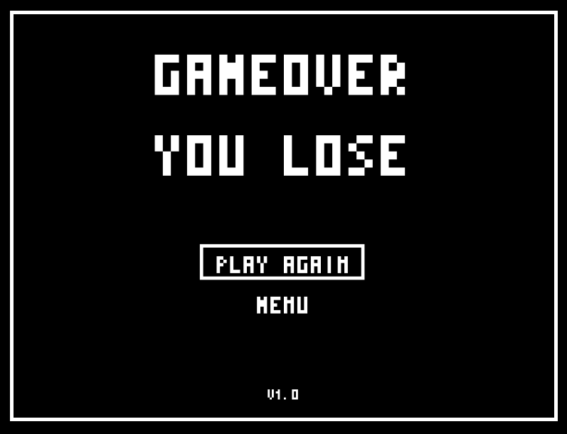
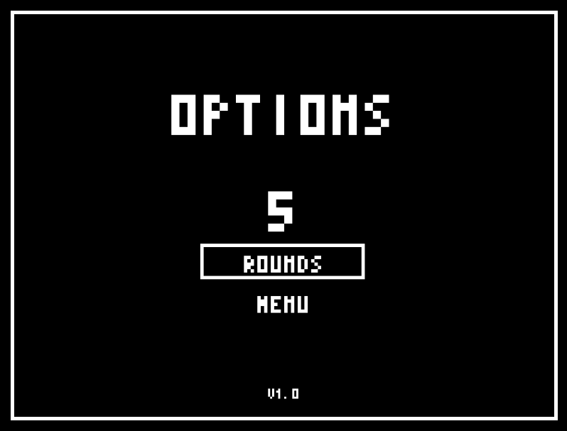
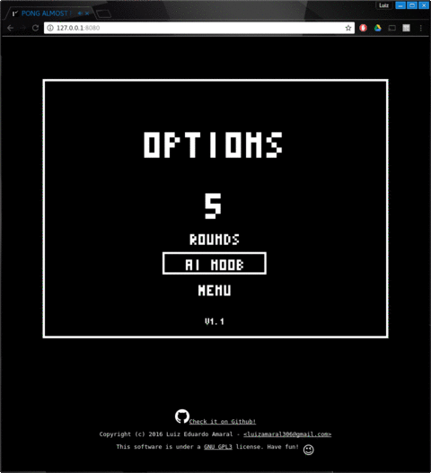

# PONG ALMOST FROM SCRATCH
This is an attempt of making the game pong using modern programming languages. The idea is to time the development and track the progress and the time it took to get in each stage in this document. If possible I want to finish this project in under 24 h.

#### Check it out [here](https://armlessjohn404.github.io/pong-almost-from-scratch/)

The game is based in html5/canvas, CSS and ES6 javascript.

## Goals
* ~~Add `LICENSE.md` and `README.md`~~
* ~~Create `html/canvas` base~~
* ~~Create the gameloop~~
* ~~Crate rendering functions~~
* ~~Design board~~
* ~~Create scoring system~~
* ~~Create paddle `class`~~
* ~~Create ball `class`~~
* ~~Implement collision mechanics~~
* ~~Host somewhere~~
* ~~Create start screen~~
* ~~Create credits screen~~
* ~~Create enemy AI~~
* ~~Add sounds~~
* ~~Improve webpage~~
* ~~Get playtesters feedback~~
* ~~List requests/bugs~~
* ~~Fix requests/bugs~~
* ~~Add gameover~~
* ~~Finished!~~

All that while reporting

## Progress reports
00:00 - START! This project has really started at October 4th, 2016 at 11:30 (BRT). I'm timing each step and will be placing the timestamp along with the achieved goal.

### 00:15 - LICENSE
This project is under a `GNU GPL3` license. Have fun! 😉

### 01:00 - Create `html/canvas` base

The `html` file was created based on a simple template.
```html
  <html>
    <head>
      <title>PONG ALMOST FROM SCRATCH</title>
      <meta name="description" content="This is an attempt of making the game pong using modern programming languages">
      <link id="favicon" rel="icon" href="assets/favicon.ico" type="image/x-icon">
      <meta charset="utf-8">
      <link rel="stylesheet" href="style.css">
    </head>
    <body>
      <div id="game-frame">
      </div>
      <script src="script.js"></script>
    </body>
  </html>
```

The `favicon.ico` was created using GIMP:


The canvas is created in the `javascript`.

I'll be using an ancient post from [Arthur Schreiber
](http://nokarma.org/2011/02/02/javascript-game-development-the-game-loop/index.html) as a base for the gameloop and keyboard input.
```javascript
"use strict"
let Game = {
  fps: 60,
  width: 800,
  height: 600
};
Game.canvas = document.createElement("canvas"); // Create canvas
Game.canvas.setAttribute("id", "game");
Game.canvas.width = Game.width;
Game.canvas.height = Game.height;

document.getElementById("game-frame").appendChild(Game.canvas); // Add canvas to game-frame

Game.context = Game.canvas.getContext("2d"); // Get canvas context
```
And a little bit of styling just to make it a little neat

```css
html {
  background-color: #444;
}
#game-frame {
  position: relative;
}

#game {
  background-color: #000;
  position: absolute;
  top: 50%;
  left: 50%;
  margin: 150px 0 0 -400px;
}
```
So, here is the first view of the game:
#### Hello world!


### 01:10 - Host somewhere

For now, I'll be hosting it in [github pages](https://pages.github.com/) since it's easy deploy. Check it out [here](https://armlessjohn404.github.io/pong-almost-from-scratch/)

### 03:20 - Crate rendering functions

The graphics in this game is not what one would call "realistic", so only one drawing function was created.
```javascript
function drawSquare(x, y, color="#FFF") {
  Game.context.fillStyle = color;
  Game.context.fillRect(x, y, gridSize, gridSize);
}
```
Another three functions uses this drawing function to speed up the development:
* `drawMatrix` which receives a boolean matrix to draw the dots.
* `writeText` which receives a string and uses `drawMatrix` and an alphabeth to draw the text.
* `drawLine` which receives two coordinates and draws a line between them.



The letters were created in a separate file. Each letter is a boolean 5x3 matrix and is mono spaced.
```javascript
let alphabeth = {
  "A": [[1, 1, 1],[1, 0, 1],[1, 1, 1],[1, 0, 1],[1, 0, 1]],
  "B": [[1, 1, 0],[1, 0, 1],[1, 1, 0],[1, 0, 1],[1, 1, 0]],
  "C": [[0, 1, 1],[1, 0, 0],[1, 0, 0],[1, 0, 0],[0, 1, 1]],
  "D": [[1, 1, 0],[1, 0, 1],[1, 0, 1],[1, 0, 1],[1, 1, 0]],
  "E": [[1, 1, 1],[1, 0, 0],[1, 1, 0],[1, 0, 0],[1, 1, 1]],
  "F": [[1, 1, 1],[1, 0, 0],[1, 1, 0],[1, 0, 0],[1, 0, 0]],
  "G": [[1, 1, 1],[1, 0, 0],[1, 0, 1],[1, 0, 1],[1, 1, 1]],
  "H": [[1, 0, 1],[1, 0, 1],[1, 1, 1],[1, 0, 1],[1, 0, 1]],
  "I": [[0, 1, 0],[0, 1, 0],[0, 1, 0],[0, 1, 0],[0, 1, 0]],
  ...
}
```

I changed a little bit the numbers `2`, `3`, `5` and `6` from the original just because I can.
I've chosen 53 characters between letters, numbers and punctuation to use in the game.

### 04:00 - Create the gameloop
The gameloop is the engine that keeps rendering the graphics on screen.
The gameloop was based on [Arthur Schreiber's
](http://nokarma.org/2011/02/02/javascript-game-development-the-game-loop/index.html) post with some tweaks. With that, I can get the player's input and update the screen.



### 04:20 - Board Design
The board for the game are just two horizontal lines and a dashed line in the center.


## 05:10 - Scoring system
For the scoring system, an object was created that draws the score in the screen when it's `draw` method is called and it's easy to update the values. It inherits some properties from a class called `BaseSprite`, that may be updated in the future. There's two important methods in these classes, the `update` method, that recalculates the new postion for the sprite and the `draw` method which draws the sprite in the screen.



## 05:30 - Paddle class
The `Paddle` class also inhertits from `BaseSprite`. Two instances of the paddles are created in the game, they bind to the keys `W` and `S` for player1 and `up arrow` and `down arrow` for player2.



## 05:55 - Ball class
The `Ball` class also inhertits from `BaseSprite`. They contain two extra properties: `speed` and `direction` to make it move in the screen.


## 08:00 - Collision mechanics
Since all the sprites are rectangles, the collision detection was made with simple `if` statements, as described in [MDN](https://developer.mozilla.org/en-US/docs/Games/Techniques/2D_collision_detection).
The collision is checked in the update methods. If the collision occurs in the left or right side of the ball, it means that it has hit the paddles, the calculation of the direction is a little bit different.



## 10:00 - Start screen/ credits screen
For splitting the screens into game states, I created objects with `init`, `draw` and `update` methods corresponding with each screen. Also a function that overwrites the gameloop's corresponding methods. Then it's just a matter of calling this function and passing the corresponding screen object to change the screen/state.




## 11:00 - Enemy AI
The game mode in which the player plays against an AI borrows all the methods from the 2 player mode, but it removes the key bindings for the `player2` and extends the `update` method with the following:
```javascript
  // calculate the distance between the center of the paddle and the ball
  let centerDelta = ball.center, paddle.center
  // limit movement to be at most paddleStep
  if (Math.abs(centerDelta) > 10) {
    Game.player2.y += paddleStep*(centerDelta>0?1:-1);
  } else {
  // move slowly if possible
    Game.player2.y += centerDelta;
  }
  // update the rest of the game
  versusScreen.update()
```

## 11:40 - Sounds
The sounds are some free `wav` files I've found at [Freesound.org](https://www.freesound.org).
Thanks to `noisecollector`, `projectsu012` and `n-audioman`.
I used `HTMLMediaElements` to play the sounds.
```javascript
Game.blip1Sound = new Audio(blip1URL);
Game.blip1Sound.play()
```

## 12:00 - Interlude
PAUSE! That was the progress until October 5th, 2016 at 00:00 (BRT).
At this stage the game is mostly done. But there's still some bugs and room for improvement.
Tomorrow I'll be improving the webpage, getting some feedback and fixing some bugs prior to release.

## 12:20 - Released for closed beta
With minor tweaks, the game was released. I'll be listing the requested bugs an features here. While I wait for feedback, I'll be working in the webpage view.

* ~~Fix ball launching too vertically - `me`, `Ule`~~
* ~~Fix ball launching from the walls - `me`~~
* ~~Improve collisions. Ball is tunneling through the paddles sometimes - `me`, `Pagode`, `Luh`~~
* ~~Ball crossed in the middle of the paddle (timing?) - `Pagode`~~
* ~~Improve letter `N` readability - `Ule`~~
* ~~Browser window moves when pressing the arrow keys - `Luh`~~
* ~~Prevent ball from sucking in the walls (not 100% but fair enough)~~

## 13:40 - Improved webpage
The webpage received a footer element and a few CSS to make it even neater.



## 15:50 - Fixed the requests
Thanks to the playtesters `Luh`, `Pagode` and `Ule` for giving feedback.

## 16:40 - Add gameover
Since there's no point in playing forever, I added two more screens, one to chose the number of rounds and a gameover screen. No much difficulty in implementing those, just a matter of controlling some global variables.





## 17:00 - Finish!!
Well, that was quite fun indeed. It's been a steep learning curve in several subjects.

It's interesting to see that a landmark in computer games can be reproduced in under 24h using modern technologies. And yes, I know that this is far from what you would call "from scratch" comparing with the tech available back then, but at least I made the drawing functions and worked with them. Maybe with the aid of a game engine this time can be reduced to a couple of hours, but then, where's the fun in that?

Since I said I'll be dedicating 24h to this project, I plan to release one patch for the game if there's enough feedback.

Thanks again to the guys that provided the audio assets for free and to the playtesters.

#### Bye!

## 20:00? - Requests for the patch
* ~~Pause game when out of focus - `Pagode`~~
* ~~Initial ball too fast - `Karkão`~~
* ~~Endless game mode - `Ule`~~
* ~~More AI options - `me`~~
* ~~Fix buggy transitions - `me`~~

## 24:00? - Final release
Today, October 5th, 2016 at 23:15 (BRT) I lost track of time somewhere in the afternoon. I haven't worked all day on the game. I'll consider it finished, even if I did not spent 24h on it.

I received some feedback from friends and fixed some bugs. I'm now releasing a patch with some changes.

Now, the game pauses when the window is out of focus, the ball starts slower and I've added an endless gamemode and three difficulties of AI in the options.



#### Thanks and Bye Again!
